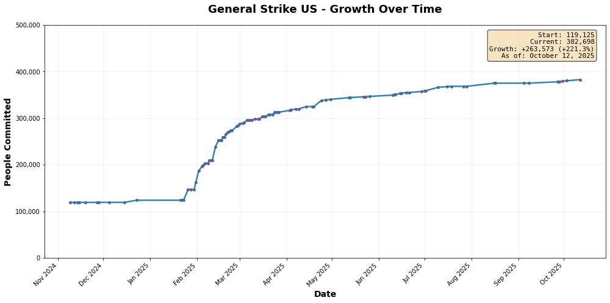

# General Strike US - Historical Data Scraper

> **Note:** The code in this repository was generated by Claude (Anthropic).



Scrapes and analyzes historical signup data for the General Strike US movement from Wayback Machine archives.

**Current Status (as of October 12, 2025):**
- **382,698 people committed** (+221.3% growth since November 2024)
- **97 data points** collected from November 2024 to October 2025

## Setup

This project uses [uv](https://github.com/astral-sh/uv) for dependency management.

```bash
# Install uv if you haven't already
curl -LsSf https://astral.sh/uv/install.sh | sh

# Install dependencies
uv sync
```

## Usage

### Scrape All Snapshots (Recommended)
Gets all available data points from the Wayback Machine:

```bash
uv run python scrape_strike_data_all.py
```

### Scrape Weekly Snapshots
Faster option that samples one snapshot per week:

```bash
uv run python scrape_strike_data_simple.py
```

### Playwright Version (Optional)
Browser-based scraper for complex JavaScript. Requires additional setup:

```bash
uv sync --extra playwright
uv run playwright install chromium
uv run python scrape_strike_data.py
```

### Generate Visualization
Create the growth plot from the data:

```bash
uv run python generate_plot.py
```

This generates `strike_growth_plot.png` with the latest data point date included.

## Data

The scraped data is in `general_strike_data.csv`:

- `date` - YYYY-MM-DD format
- `timestamp` - Wayback Machine timestamp
- `committed` - Number of people committed
- `needed` - Still needed to reach 11M (11,000,000 - committed)
- `url` - Link to Wayback Machine snapshot

## Updating the Dataset

Simply run a scraper to check for new snapshots:

```bash
uv run python scrape_strike_data_all.py
```

The script will:
- Automatically fetch the latest snapshots from the Wayback Machine CDX API
- Skip dates with existing valid data
- Save snapshot metadata to `wayback_snapshots.json`

## Files

- `scrape_strike_data_all.py` - Scrapes all available snapshots
- `scrape_strike_data_simple.py` - Scrapes weekly snapshots
- `scrape_strike_data.py` - Playwright version (optional)
- `generate_plot.py` - Creates visualization plot
- `general_strike_data.csv` - Main dataset (97 entries)
- `strike_growth_plot.png` - Visualization
- `wayback_snapshots.json` - Cached snapshot metadata (auto-generated)

---

*Last Updated: October 15, 2025*
