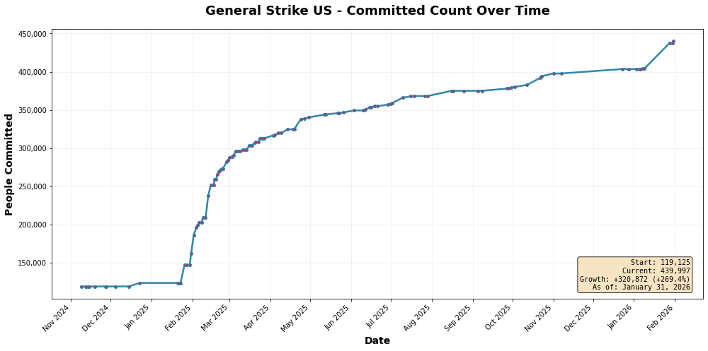
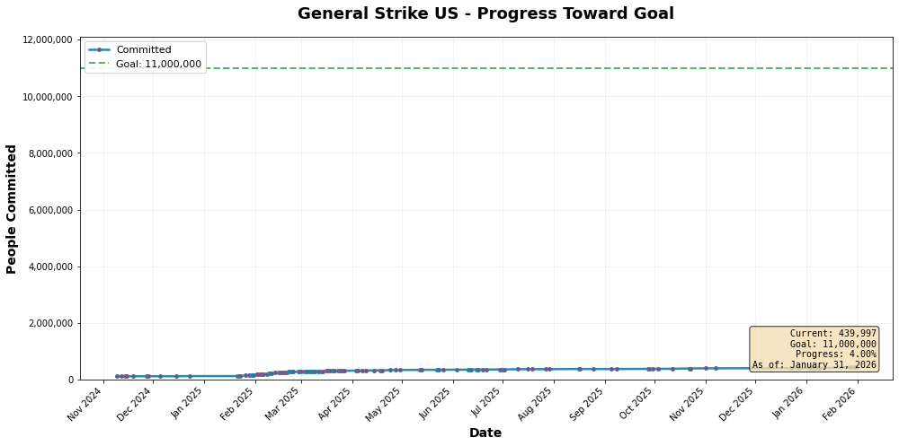
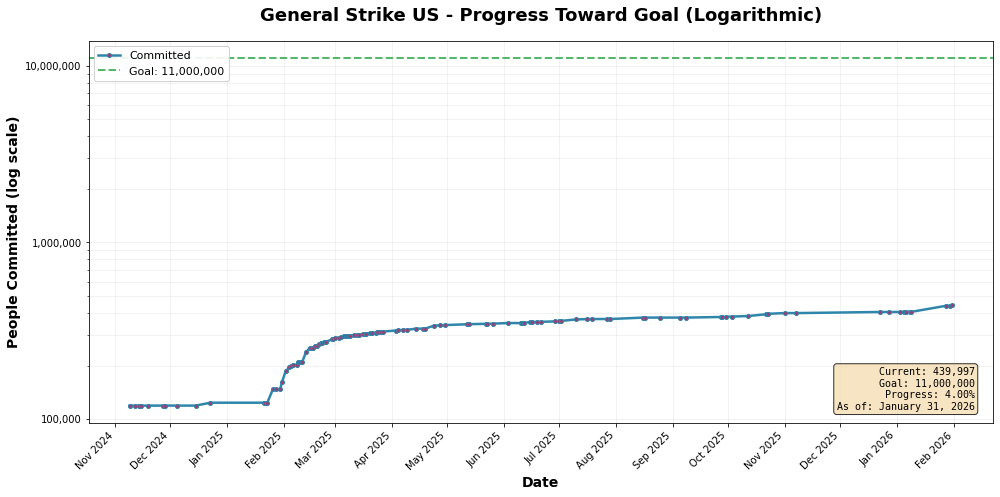
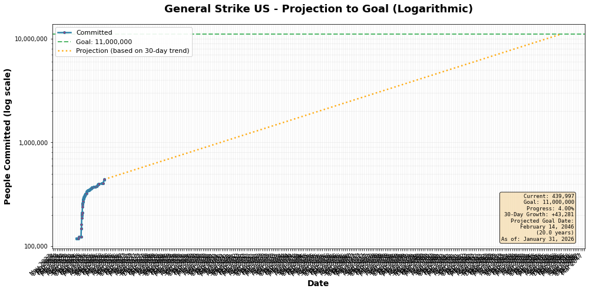

# General Strike US - Historical Data Scraper

> **Note:** The code in this repository was generated by Claude (Anthropic).


Scrapes and analyzes historical signup data for the General Strike US movement from Wayback Machine archives.

**Current Status (as of January 31, 2026):**
- **440,014 people committed** (+269.4% growth since November 2024)
- **134 data points** collected from November 2024 to 2026
- **4.00% progress** toward 11 million goal
- **~1,304 people/day** average growth rate (last 30 days)

📊 **[View Detailed Analysis](RESULTS_2026-01-30.md)** - Comprehensive analysis with projections and insights

## Setup

This project uses [uv](https://github.com/astral-sh/uv) for dependency management.

```bash
# Install uv if you haven't already
curl -LsSf https://astral.sh/uv/install.sh | sh

# Install dependencies
uv sync
```

## Usage

### Scrape All Snapshots (Recommended)
Gets all available data points from the Wayback Machine:

```bash
uv run python scrape_strike_data_all.py
```

### Scrape Weekly Snapshots
Faster option that samples one snapshot per week:

```bash
uv run python scrape_strike_data_simple.py
```

### Playwright Version (Optional)
Browser-based scraper for complex JavaScript. Requires additional setup:

```bash
uv sync --extra playwright
uv run playwright install chromium
uv run python scrape_strike_data.py
```

### Generate Visualizations

Generate all 4 plots (basic, with goal, logarithmic, and projected):

```bash
# Generate plots from fine-grained data (recommended)
uv run python generate_all_plots_fine_grained.py

# Generate plots from Wayback-only data
uv run python generate_all_plots.py

# Custom CSV and output directory
uv run python generate_all_plots_fine_grained.py --csv mydata.csv --output images/custom/
```

This generates 4 visualization types:
1. Basic growth trajectory
2. Progress toward goal line
3. Logarithmic scale view
4. Future projection based on 30-day trend

Plots are saved to `images/plots_finegrained/` or `images/plots_waybackonly/` by default.

## Data

### Datasets

**`general_strike_data.csv`** - Wayback Machine snapshots (113 data points)
- Daily snapshots from Wayback Machine archives
- November 2024 through January 2026

**`general_strike_data plus-fine-grained.csv`** - Combined dataset (133 data points)
- Includes all Wayback Machine data
- Plus 20 hourly measurements from January 12-26, 2026
- Higher temporal resolution for recent data

### CSV Format
- `date` - YYYY-MM-DD format
- `timestamp` - Wayback Machine timestamp (YYYYMMDDHHMMSS)
- `committed` - Number of people committed
- `needed` - Still needed to reach 11M (11,000,000 - committed)
- `url` - Link to Wayback Machine snapshot (empty for fine-grained data)

## Updating the Dataset

### Automatic Updates (GitHub Actions)

This repository automatically scrapes the live site daily via GitHub Actions:

- **Schedule**: Runs daily at 12:00 UTC
- **Process**:
  1. Scrapes current data from generalstrikeus.com
  2. Appends to fine-grained CSV if data is newer
  3. Regenerates all visualization plots
  4. Updates README with latest statistics
  5. Commits and pushes changes automatically

**Manual Trigger**: You can also trigger the workflow manually from the Actions tab on GitHub.

### Manual Updates

#### Scrape Wayback Machine Archives

Fetch historical snapshots from the Wayback Machine:

```bash
uv run python scrape_strike_data_all.py
```

The script will:
- Automatically fetch the latest snapshots from the Wayback Machine CDX API
- Skip dates with existing valid data
- Save snapshot metadata to `wayback_snapshots.json`

#### Scrape Live Site

Get the current data from the live site:

```bash
python scrape_live_site.py
```

This appends the current count to the fine-grained CSV if it's newer than the latest entry.

## Visualization Gallery

| Plot Type | Fine-Grained | Wayback Only |
|-----------|-------------|--------------|
| Basic Growth |  |  |
| With Goal |  |  |
| Logarithmic |  |  |
| Projection |  |  |

## Files

### Scrapers
- `scrape_live_site.py` - Scrapes current data from live site (used by GitHub Actions)
- `scrape_strike_data_all.py` - Scrapes all available Wayback Machine snapshots (recommended)
- `scrape_strike_data_simple.py` - Scrapes weekly Wayback Machine snapshots (faster)
- `scrape_strike_data.py` - Playwright version (optional, for JS-heavy pages)

### Automation
- `.github/workflows/daily-scrape.yml` - GitHub Actions workflow for daily updates
- `update_readme.py` - Updates README.md with latest statistics

### Plot Generators
- `generate_all_plots_fine_grained.py` - Generate all plots from fine-grained data
- `generate_all_plots.py` - Generate all plots from Wayback-only data
- `generate_plot.py` - Legacy single plot generator

### Data Files
- `general_strike_data.csv` - Wayback Machine dataset (113 entries)
- `general_strike_data plus-fine-grained.csv` - Combined dataset (133 entries)
- `wayback_snapshots.json` - Cached snapshot metadata (auto-generated)
- `RESULTS_2026-01-30.md` - Comprehensive analysis report

### Visualizations
- `images/plots_finegrained/` - Plots with fine-grained hourly data
- `images/plots_waybackonly/` - Plots with Wayback Machine data only

## Analysis

See **[RESULTS_2026-01-30.md](RESULTS_2026-01-30.md)** for:
- Detailed growth analysis and trends
- Statistical breakdown by time period
- Projection analysis and caveats
- Key findings and conclusions

---

*Last Updated: January 30, 2026*
