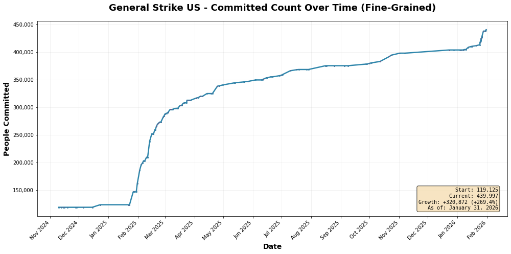
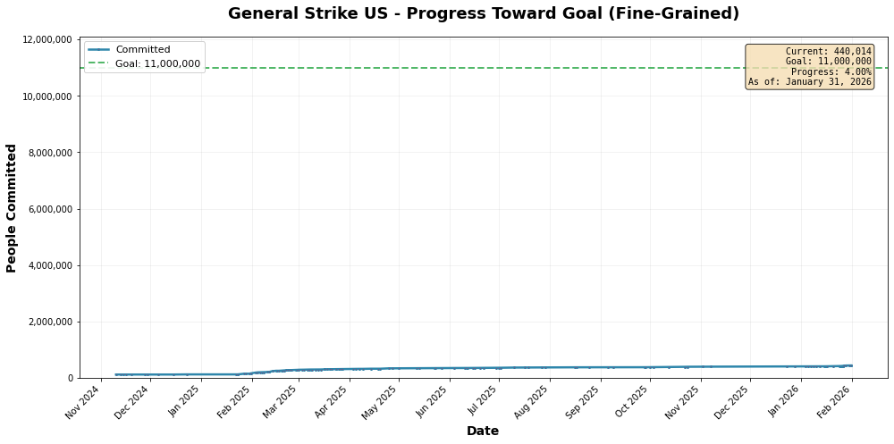
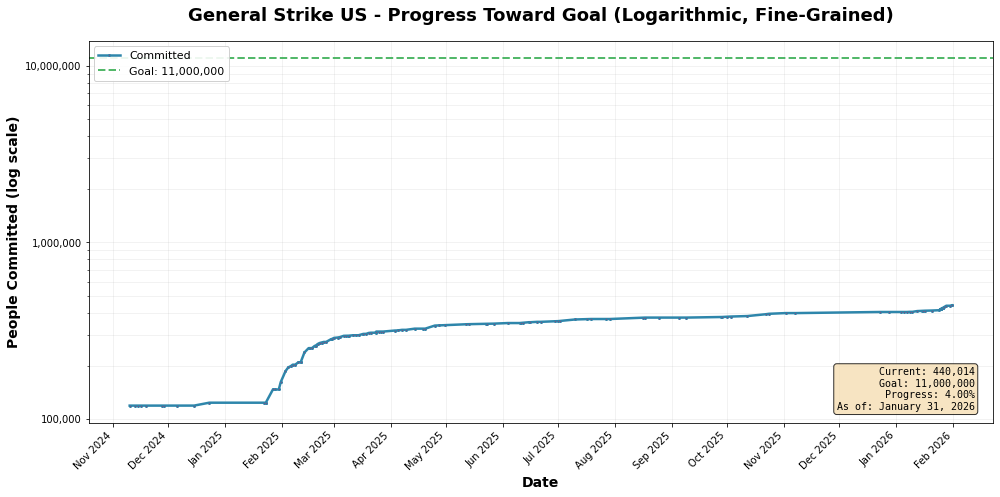
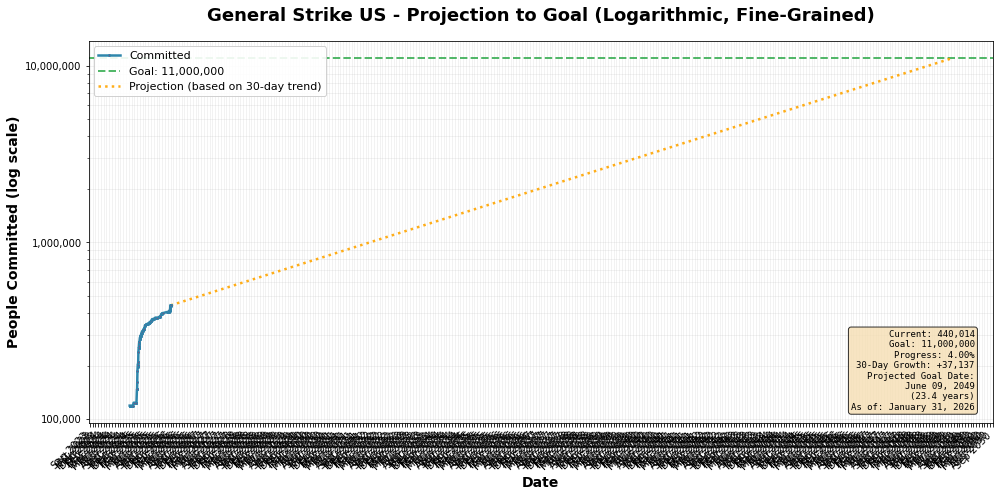

# General Strike US - Analysis Results
**Date: January 30, 2026**

## Executive Summary

This analysis examines the growth of the General Strike US movement from November 2024 through January 2026, using data from Wayback Machine archives and recent fine-grained measurements. The dataset includes 133 data points, with hourly resolution data available for the most recent period.

### Current Status (as of January 31, 2026)
- **Total Committed**: 439,997 people
- **Goal**: 11,000,000 people
- **Progress**: 4.00% of goal achieved
- **Total Growth**: +320,872 people (+269.4% since November 2024)

## Data Overview

### Dataset Details
- **Time Period**: November 9, 2024 - January 31, 2026 (14+ months)
- **Total Data Points**: 133 measurements
  - 113 from Wayback Machine daily snapshots
  - 20 fine-grained hourly measurements (January 12-26, 2026)
- **Starting Value**: 119,125 people (November 9, 2024)
- **Current Value**: 439,997 people (January 31, 2026)

### Data Sources
1. **Wayback Machine Archives**: Daily snapshots from generalstrikeus.com
2. **Fine-Grained Data**: Hourly measurements from live site monitoring (January 2026)

## Growth Analysis

### Overall Growth Trajectory

The growth trajectory shows distinct phases:

1. **Plateau Phase** (Nov 2024 - Jan 2025): ~119,000 people, minimal growth
2. **Initial Surge** (Late Jan 2025): Jump to ~147,000 (+23.4%)
3. **Rapid Growth** (Feb-Mar 2025): Acceleration to ~300,000+
4. **Steady Growth** (Apr-Dec 2025): Consistent gradual increase
5. **Recent Acceleration** (Jan 2026): Sharp uptick to ~440,000

### Progress Toward Goal

Current progress represents 4.00% of the 11 million goal. While significant growth has occurred, the movement remains in early stages relative to its stated objective.

### Logarithmic View

The logarithmic scale reveals the exponential nature of early growth, particularly during the February-March 2025 surge. Recent growth has stabilized to a more linear pattern.

## Growth Rate Analysis

### Recent Performance (Last 30 Days)
- **30-Day Growth**: +35,341 people
- **Daily Average**: +1,178 people/day
- **Weekly Average**: +8,246 people/week
- **Monthly Rate**: ~8.7% growth

### Historical Comparison
- **Total Period** (14 months): +320,872 people
- **Average Monthly Growth**: ~22,919 people/month
- **Compound Monthly Growth Rate**: ~8.2%

## Projection Analysis

Based on the last 30 days of fine-grained data, linear projection yields:

- **Projected Goal Date**: December 6, 2050
- **Time to Goal**: 24.4 years
- **Assumptions**: Linear growth at current rate (~1,178/day)

### Projection Caveats

This projection assumes:
1. **Linear growth continuation** - unlikely for viral movements
2. **No external catalysts** - political events could accelerate
3. **Sustained momentum** - requires continuous engagement
4. **Current growth rate** - may increase or decrease significantly

**Reality Check**: Movement growth typically follows non-linear patterns. Actual timeline could be:
- **Shorter** if: viral catalyst, major political event, media coverage
- **Longer** if: momentum loss, competing movements, goal fatigue

## Key Findings

### 1. Growth Phases
The movement has experienced multiple distinct growth phases, with the most dramatic expansion occurring in February-March 2025, suggesting a catalyzing event or media attention spike.

### 2. Recent Acceleration
Fine-grained data from January 2026 shows renewed acceleration with hourly growth patterns indicating sustained engagement:
- January 12-26: +19,751 people in 14 days
- Average: +1,411 people/day during this period

### 3. Scale Challenge
At current growth rates, reaching the 11 million goal would take approximately 24 years. To achieve the goal more rapidly would require:
- **5 years**: ~57,000 new people/day (48x current rate)
- **2 years**: ~143,000 new people/day (121x current rate)
- **1 year**: ~287,000 new people/day (244x current rate)

### 4. Growth Sustainability
The movement has maintained positive growth for over 14 months, demonstrating sustained interest and organizational capacity.

## Statistical Summary

| Metric | Value |
|--------|-------|
| Current Committed | 439,997 |
| Starting Point (Nov 2024) | 119,125 |
| Total Growth | +320,872 (+269.4%) |
| Goal | 11,000,000 |
| Progress to Goal | 4.00% |
| Days Tracked | 448+ days |
| Average Daily Growth | +716 people/day |
| Recent Daily Growth (30d) | +1,178 people/day |
| Projected Years to Goal | 24.4 years (linear) |

## Methodology

### Data Collection
1. **Wayback Machine Scraping**: Automated scraping of archived snapshots using CDX API
2. **Fine-Grained Monitoring**: Hourly measurements from live site during January 2026
3. **Data Validation**: Filtering invalid entries and ensuring numeric integrity

### Analysis Tools
- **Python**: Data processing and statistical analysis
- **Matplotlib**: Visualization and plotting
- **NumPy**: Linear regression for projections

### Projection Method
Linear regression on last 30 days of data:
- Converts timestamps to days since reference point
- Fits linear model: `committed = daily_rate × days + intercept`
- Projects forward to goal intersection

## Limitations

1. **Incomplete Coverage**: Wayback Machine snapshots may miss rapid changes between captures
2. **Linear Assumptions**: Projections assume linear growth, which is unlikely for social movements
3. **External Factors**: Cannot account for future events, media coverage, or political changes
4. **Data Granularity**: Daily snapshots may miss intraday volatility
5. **Sample Bias**: Recent fine-grained data is a small sample (14 days)

## Conclusions

The General Strike US movement has demonstrated sustained growth over 14+ months, with current participation at approximately 440,000 people. While this represents significant progress from the November 2024 baseline, achieving the 11 million goal will require substantial acceleration beyond current growth rates.

Key indicators:
- ✅ **Sustained Momentum**: Positive growth maintained over 14+ months
- ✅ **Recent Acceleration**: January 2026 shows increased daily growth rate
- ⚠️ **Scale Gap**: Current rate insufficient for near-term goal achievement
- ⚠️ **Projection Uncertainty**: Long timeline suggests need for catalyzing events

The movement has successfully built a base of nearly 440,000 committed participants, representing a foundation for potential exponential growth if proper catalysts emerge.

---

## Appendix: Additional Visualizations

All plots are available in the `images/plots_finegrained/` directory:
- `plot_1_basic_fine_grained.png` - Basic growth trajectory
- `plot_2_with_goal_fine_grained.png` - Progress relative to goal
- `plot_3_logarithmic_fine_grained.png` - Logarithmic scale view
- `plot_4_with_projection_fine_grained.png` - Future projection

## Data Files

- `general_strike_data.csv` - Wayback Machine data (113 points)
- `general_strike_data plus-fine-grained.csv` - Combined dataset (133 points)
- `wayback_snapshots.json` - CDX API snapshot metadata

---

*Analysis generated: January 30, 2026*
*Data through: January 31, 2026*
*Tools: Python 3.12, Matplotlib, NumPy*
